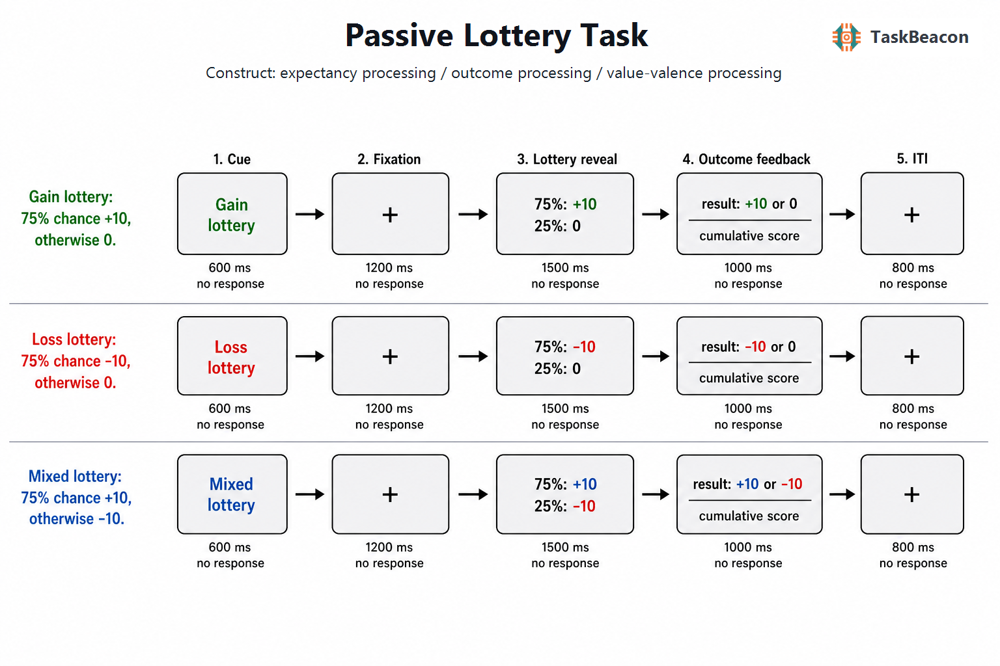

# 被动彩票任务的测量逻辑、神经表征与解释边界：从预期价值到结果预测误差

概率性结果加工研究需要区分至少三类相邻过程：结果出现前对价值与不确定性的表征、结果出现后对实际所得的评价，以及实际结果相对先验预期的偏离。选择任务常使这些过程同时受到动作选择、反应时、正确性与控制感影响。被动彩票任务（Passive Lottery Task）通过外显呈现概率—结果分布，并由计算机抽取结果，使参与者无需在单个试次作出选择。该操作提高了预期阶段与结果阶段的可分离性，也为检验期望价值、风险、结果效价和预测误差提供了简洁载体。不过，“被动彩票任务”是共享上述逻辑的一组实验变式，并非具有统一刺激、时长和计分规则的单一标准测验。其科学价值主要体现为对计算变量的实验操纵和神经信号估计，而非产生准确率或反应时等传统行为成绩。

## 1. 范式提出与理论背景

被动彩票范式的理论基础来自预测误差学习。Rescorla–Wagner 模型以实际强化与当前预期之差更新线索价值，随后神经生理研究发现中脑多巴胺神经元的相位性反应符合“所得减去所期”的有符号误差信号（Rescorla & Wagner, 1972; Schultz et al., 1997）。人类功能磁共振成像（functional magnetic resonance imaging, fMRI）研究继而把货币前景与结果在时间上分开。早期“金钱轮盘”研究显示，前景期与结果期均可引起纹状体及眶额区域的条件相关活动，但二者的空间重叠不能证明其承担同一计算（Breiter et al., 2001）。结果好坏、发生概率与结果惊奇度需要通过正交设计或参数模型进一步区分。

该范式族的发展有两条直接线索。第一条线索以已知彩票为刺激，分别估计期望价值、风险和结果预测误差。Preuschoff 等（2006）在减少学习与动作要求的赌博设计中发现，预期早期的腹侧纹状体活动随期望收益变化，稍后的活动随收益方差变化；Abler 等（2006）则报告伏隔核结果期信号随奖励概率所规定的预测误差近似线性变化。Rutledge 等（2010）进一步采用无选择彩票，以公理化检验替代对单一强化学习模型的拟合，发现纹状体、内侧前额叶、杏仁核与后扣带测量满足一类奖励预测误差模型的约束，而前岛叶活动不满足该组公理。第二条线索考察没有即时选择时是否仍可估计主观价值。Levy 等（2011）发现，被动观看单个彩票时的纹状体和内侧前额叶血氧水平依赖（blood-oxygen-level-dependent, BOLD）信号可预测之后的实际选择，说明价值表征不以试次内动作选择为必要条件。

随后研究把已知的一阶概率扩展至概率本身的不确定性。Bach 等（2011）连续操纵二阶不确定性，表明“风险”与“模糊性”不能仅用一个已知/未知分类概括。这一发展提示，被动彩票中的概率、结果幅度、效价和概率可信度应分别记录；把所有非确定性条件统称为风险会损害构念效度。

## 2. 任务逻辑、流程与核心测量

典型试次先呈现条件或概率线索，经过固定注视或延迟后显示彩票分布，再呈现抽取结果和试次间隔。参与者通常只需持续观看，少数版本在独立阶段要求偏好判断或概率报告。结果由预先规定的概率分布抽取；若研究目的包括学习，线索—结果关联可随试次更新，若研究目的在于价值解码，则概率与结果集合通常在任务开始前已知。不同论文的具体时长差异较大，因此不存在可脱离成像采样率、事件间共线性和目标成分而普遍适用的“标准时长”。

| 阶段 | 主要操作 | 常用指标或对比 | 支持的解释及主要混淆 |
|---|---|---|---|
| 条件线索/彩票呈现 | 显示可得结果及其概率 | 期望价值参数、方差/熵参数；增益、损失与混合条件对比 | 支持预期价值或不确定性表征；同时受视觉形式、效价与概率显著性影响 |
| 延迟 | 注视并保持当前彩票信息 | 延迟期 BOLD、刺激前负波或慢电位 | 支持预期维持；固定时长会使其与相邻阶段难以分离 |
| 结果反馈 | 显示实际增益、损失或零结果 | 实际结果、带符号预测误差、绝对预测误差；有利与不利结果对比 | 支持结果评价或惊奇加工；结果频率、效价、幅度和控制感可共同影响信号 |
| 试次间隔 | 注视或空屏 | 基线及血流动力学恢复 | 提供事件分离基线；过短或无抖动会增加阶段回归量共线性 |

对每个结果 (r_t)，最简预测误差可写作 \(\delta_t=r_t-E[r_t]\)。只有当结果概率和幅度均被明确规定时，才能把结果效价与预测误差分开。例如，同为“+10”的结果，在 25% 与 75% 概率条件下具有不同的正预测误差。绝对误差 \(|\delta_t|\) 则更接近惊奇度或动机性显著性。若设计只比较中奖与未中奖，所得差异同时包含结果效价、概率与视觉反馈差异，不能单独识别预测误差。无试次内反应可降低动作选择与运动准备的混淆，却也意味着任务本身通常不提供准确率、反应时或选择一致性；主要因变量转为条件参数、抽取结果，以及与线索和反馈锁定的生理信号。

## 3. 主要行为与神经科学发现

### 3.1 预期价值、风险与无选择价值表征

fMRI 证据较一致地支持纹状体—内侧前额叶系统参与已知彩票价值的表征，但具体信号依赖阶段与模型。前景期活动可随期望收益变化，风险相关活动可能在随后时窗出现（Preuschoff et al., 2006）；被动观看产生的活动还可跨阶段预测后续偏好（Levy et al., 2011）。这些结果支持“无即时选择仍可形成可解码价值信号”，但不表明被动观看与真实选择具有相同心理状态。注意分配、未来将作选择的预期以及显示属性均可能贡献预测效力。

结果期的核心问题是神经活动反映有符号价值误差，还是对任何意外事件的无符号显著性反应。纹状体 BOLD 与奖励概率及结果的关系符合预测误差模型（Abler et al., 2006; Rutledge et al., 2010），而惩罚和厌恶结果研究显示，纹状体、前岛叶与扣带活动也可随绝对误差增强（Météreau & Dreher, 2013）。因此，脑区名称不能替代计算解释。只有同时建模实际结果、期望价值、带符号误差和绝对误差，并控制这些回归量的相关性，才可比较价值与显著性账户。fMRI 提供条件相关活动的空间分布，单凭 BOLD 相关性不足以证明某一区域生成预测误差或对行为具有因果作用。

### 3.2 EEG 所揭示的结果加工时间进程

事件相关电位（event-related potential, ERP）为结果加工提供毫秒级证据。反馈相关负波（feedback-related negativity, FRN）及以“奖励减损失”差异表示的奖励正波（reward positivity, RewP）通常在反馈后约 200–350 ms 的额中央区域出现。主动—被动区块比较发现，两种条件均可出现对“比预期更差”结果增强的内侧额叶负向成分，但参与者亲自作出选择时效应更大（Martin & Potts, 2011）。由此可见，取消反应减少了控制感与动作归因，却也会改变结果监控信号的幅度，主动版本的效应量不能直接移植到被动版本。

跨研究汇总支持 FRN/RewP 对奖励概率与幅度敏感，同时也显示广泛的无符号显著性效应（Sambrook & Goslin, 2015）。近期单试次时空频分析进一步表明，传统 200–350 ms 平均波幅可能叠加损失相关额中央 theta、中奖相关后部 delta/RewP 与较晚的概率效应（Hoy et al., 2021）。Glazer 与 Nusslock（2022）发现，稀有反馈的重复频率可同时改变 P2、RewP 和 P3；控制刺激频率后，有利结果主要增强 RewP 与 P3。Stewardson 与 Sambrook（2023）的元分析则提示较早成分偏向编码当前试次可得结果的效价，较晚成分才对更广实验背景中的定量价值敏感。上述证据说明，增益、损失和混合彩票若使用不同结果频率或不同颜色，简单差异波会混入概率、效价、显著性和低级知觉差异。头皮 ERP 可约束时间进程，其空间来源仍需谨慎解释。

## 4. 范式发展与主要应用

被动彩票最成熟的应用是检验计算变量能否在缺少当下选择时被神经信号识别。其一，无选择阶段与后续真实选择结合，可检验被动价值信号的外部预测效度（Levy et al., 2011）。其二，概率、幅度与效价的独立操纵可比较奖励预测误差和显著性预测误差，并考察增益与惩罚是否共享编码（Rutledge et al., 2010; Météreau & Dreher, 2013）。其三，降低运动和决策负担有利于儿童或临床样本完成任务，但“可完成”不等于“可诊断”。儿童金钱反馈任务中的 RewP 已表现出较好的内部一致性与约八个月重测信度（Szenczy et al., 2021），成人样本的 RewP 也可达到良好重测信度（Amir et al., 2023）；这些结果来自特定反馈任务和计分方法，不能视为所有被动彩票版本的既定信度。

临床研究常把奖励反应减弱与快感缺失、抑郁或其他精神病理联系起来。现有证据更适合支持群体层面的关联和候选机制研究。被动彩票缺少选择行为，难以区分主观价值降低、注意不足、概率理解偏差与对积分缺少动机。若用于发展或临床研究，应增加概率理解检查、主观愉悦/唤醒评分或独立选择测验，并预先规定这些辅助指标与神经对比的关系。

## 5. 测量效度、信度与解释边界

该范式的内部效度取决于参数是否能识别目标构念。概率、幅度、效价和结果频率若同时变化，条件主效应只能解释为复合的彩票情境差异。累积总分还会引入财富水平、近期结果序列和参考点变化；若结果不兑换实际金钱，积分的激励价值需单独验证。被动观看减少动作混淆，但也缺少在线行为证据来确认参与者持续注意并理解概率。眼动、间歇理解题或任务后概率回忆可作为操纵检查，但加入即时反应会改变原有的被动性质。

群体平均的稳定激活不保证个体排序可靠。常见任务 fMRI 指标的重测信度总体偏低，平均区域或体素对比尤其不宜未经专门验证便用作个体生物标志物（Elliott et al., 2020）。ABCD 数据中包含奖励加工任务的分析同样显示，儿童任务 fMRI 的内部信度和长期稳定性面临明显限制（Kennedy et al., 2022）。相较之下，特定算法下的 RewP 可获得较好信度（Szenczy et al., 2021; Amir et al., 2023），但差异波信度仍受试次数、伪迹、基线和成分量化方式影响。研究设计应把构念效度、群体效应可重复性与个体测量信度分别报告。

事件时序决定可解释性。固定且相邻的线索、延迟和反馈可满足行为展示，却不必然适合事件相关 fMRI 的阶段分离；EEG 中重复使用不同颜色或频率的结果刺激也可能产生与价值无关的成分。预测误差分析还要求概率先验对参与者有效。若概率仅被展示而未被理解，模型中的 \(E[r_t]\) 是实验者规定值，不一定等于参与者的主观预期。现有证据支持被动彩票用于研究概率性价值与结果加工的群体平均规律，尚不足以把单次测量解释为稳定人格特征、临床诊断或因果性神经机制。

## 6. TaskBeacon 中的任务实现

### 6.1 任务资源与访问入口

| 资源 | ID | 用途 | 地址 |
|---|---|---|---|
| 完整本地实验实现 | T000022 | PsychoPy 行为实验源码，包含三条件、计分与事件标记 | https://github.com/TaskBeacon/T000022-passive-lottery |
| 浏览器预览源码 | H000022 | `psyflow-web` 行为原型，用于网页体验与流程核对 | https://github.com/TaskBeacon/H000022-passive-lottery |
| 在线运行入口 | H000022 | 直接运行浏览器预览；不等同于附加 EEG、MRI 或临床采集硬件的版本 | https://taskbeacon.github.io/psyflow-web/?task=H000022-passive-lottery |

T000022 当前元数据将采集类型标记为行为、成熟度标记为草案；H000022 标记为行为型网页原型。两者当前配置均为 3 个区块、每区块 24 个试次，而网页仓库说明中的“缩短试次数”未反映在所核对的当前配置中。因而，浏览器版本应作为预览使用，不应据其原型标签推断与特定神经采集环境等价。

### 6.2 实现流程与关键参数

TaskBeacon 当前版本在每个区块内平衡增益、损失和混合三类彩票并随机排序，使用固定种子预先抽取结果。增益彩票以 0.75 概率获得 +10 分、否则 0 分；损失彩票以 0.75 概率获得 −10 分、否则 0 分；混合彩票以 0.50 概率获得 +10 分、否则 −10 分。因此三条件分别同时改变期望值（+7.5、−7.5、0）、结果效价集合和方差，条件主效应不能单独归因于某一个参数。任务不采用随表现变化的自适应控制器，也不要求试次内按键；记录字段包括条件、概率、两个可能结果、实际结果类型与数值以及累计得分。现有仓库文件无法确认积分是否兑换为实际金钱。

**图 1. TaskBeacon 被动彩票任务的试次流程。** 每个试次依次呈现条件线索 600 ms、中央注视 1200 ms、彩票概率—结果信息 1500 ms、实际结果及累计得分 1000 ms和固定注视间隔 800 ms，全程没有试次内反应窗口。增益条件为 75% 的 +10 分与 25% 的 0 分，损失条件为 75% 的 −10 分与 25% 的 0 分；当前配置中的混合条件为 50% 的 +10 分与 50% 的 −10 分。图内混合彩票示例仍标注为 75%/25%，分析与复现实验应以当前配置及逐试次日志中的 50%/50% 为准。结果按各条件概率使用固定随机种子预先抽取，试次得分直接累加，不实施基于表现的自适应调整。

该实现的固定试次总时长为 5.1 s，三个条件在每区块各出现 8 次。固定时序便于行为演示和事件标记，但不提供抖动；若转用于事件相关 fMRI，需根据重复时间、血流动力学模型和目标对比重新评估阶段可分离性。若用于 EEG，三类反馈应在刺激颜色、物理频率与试次数上保持可比较，并预先区分结果效价、结果稀有性与模型预测误差。当前实现最直接支持对确定概率下增益、损失和混合彩票情境的被动结果加工研究；对纯期望价值、纯风险或个体临床指标的推断需要额外正交操纵与信度验证。

## 参考文献

Abler, B., Walter, H., Erk, S., Kammerer, H., & Spitzer, M. (2006). Prediction error as a linear function of reward probability is coded in human nucleus accumbens. *NeuroImage, 31*(2), 790–795. https://doi.org/10.1016/j.neuroimage.2006.01.001

Amir, N., Holbrook, A., Meissel, E., & Taboas, W. (2023). The psychometric properties and clinical utility of neural measures of reward processing. *Social Cognitive and Affective Neuroscience, 18*(1), nsad007. https://doi.org/10.1093/scan/nsad007

Bach, D. R., Hulme, O., Penny, W. D., & Dolan, R. J. (2011). The known unknowns: Neural representation of second-order uncertainty, and ambiguity. *The Journal of Neuroscience, 31*(13), 4811–4820. https://doi.org/10.1523/JNEUROSCI.1452-10.2011

Breiter, H. C., Aharon, I., Kahneman, D., Dale, A., & Shizgal, P. (2001). Functional imaging of neural responses to expectancy and experience of monetary gains and losses. *Neuron, 30*(2), 619–639. https://doi.org/10.1016/S0896-6273(01)00303-8

Elliott, M. L., Knodt, A. R., Ireland, D., Morris, M. L., Poulton, R., Ramrakha, S., Sison, M. L., Moffitt, T. E., Caspi, A., & Hariri, A. R. (2020). What is the test-retest reliability of common task-functional MRI measures? New empirical evidence and a meta-analysis. *Psychological Science, 31*(7), 792–806. https://doi.org/10.1177/0956797620916786

Glazer, J., & Nusslock, R. (2022). Outcome valence and stimulus frequency affect neural responses to rewards and punishments. *Psychophysiology, 59*(3), e13981. https://doi.org/10.1111/psyp.13981

Hoy, C. W., Steiner, S. C., & Knight, R. T. (2021). Single-trial modeling separates multiple overlapping prediction errors during reward processing in human EEG. *Communications Biology, 4*(1), Article 910. https://doi.org/10.1038/s42003-021-02426-1

Kennedy, J. T., Harms, M. P., Korucuoglu, O., Astafiev, S. V., Barch, D. M., Thompson, W. K., Bjork, J. M., & Anokhin, A. P. (2022). Reliability and stability challenges in ABCD task fMRI data. *NeuroImage, 252*, 119046. https://doi.org/10.1016/j.neuroimage.2022.119046

Levy, I., Lazzaro, S. C., Rutledge, R. B., & Glimcher, P. W. (2011). Choice from non-choice: Predicting consumer preferences from blood oxygenation level-dependent signals obtained during passive viewing. *The Journal of Neuroscience, 31*(1), 118–125. https://doi.org/10.1523/JNEUROSCI.3214-10.2011

Martin, L. E., & Potts, G. F. (2011). Medial frontal event-related potentials and reward prediction: Do responses matter? *Brain and Cognition, 77*(1), 128–134. https://doi.org/10.1016/j.bandc.2011.04.001

Météreau, E., & Dreher, J.-C. (2013). Cerebral correlates of salient prediction error for different rewards and punishments. *Cerebral Cortex, 23*(2), 477–487. https://doi.org/10.1093/cercor/bhs037

Preuschoff, K., Bossaerts, P., & Quartz, S. R. (2006). Neural differentiation of expected reward and risk in human subcortical structures. *Neuron, 51*(3), 381–390. https://doi.org/10.1016/j.neuron.2006.06.024

Rescorla, R. A., & Wagner, A. R. (1972). A theory of Pavlovian conditioning: Variations in the effectiveness of reinforcement and nonreinforcement. In A. H. Black & W. F. Prokasy (Eds.), *Classical conditioning II: Current research and theory* (pp. 64–99). Appleton-Century-Crofts.

Rutledge, R. B., Dean, M., Caplin, A., & Glimcher, P. W. (2010). Testing the reward prediction error hypothesis with an axiomatic model. *The Journal of Neuroscience, 30*(40), 13525–13536. https://doi.org/10.1523/JNEUROSCI.1747-10.2010

Sambrook, T. D., & Goslin, J. (2015). A neural reward prediction error revealed by a meta-analysis of ERPs using great grand averages. *Psychological Bulletin, 141*(1), 213–235. https://doi.org/10.1037/bul0000006

Schultz, W., Dayan, P., & Montague, P. R. (1997). A neural substrate of prediction and reward. *Science, 275*(5306), 1593–1599. https://doi.org/10.1126/science.275.5306.1593

Stewardson, H., & Sambrook, T. D. (2023). Valence precedes value in neural encoding of prediction error. *Psychophysiology, 60*(7), e14266. https://doi.org/10.1111/psyp.14266

Szenczy, A. K., Levinson, A. R., Hajcak, G., Bernard, K., & Nelson, B. D. (2021). Reliability of reward- and error-related brain activity in early childhood. *Developmental Psychobiology, 63*(6), e22175. https://doi.org/10.1002/dev.22175
